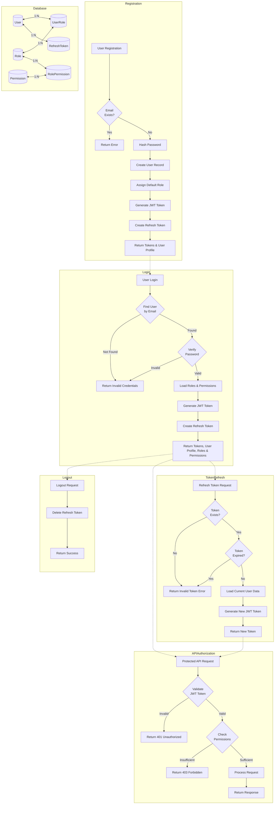

# Auth flow

```mermaid
flowchart TD
    %% Main Authentication Flows
    subgraph Registration
        A[User Registration] --> B{Email\nExists?}
        B -->|Yes| C[Return Error]
        B -->|No| D[Hash Password]
        D --> E[Create User Record]
        E --> F[Assign Default Role]
        F --> G[Generate JWT Token]
        G --> H[Create Refresh Token]
        H --> I[Return Tokens & User Profile]
    end

    subgraph Login
        J[User Login] --> K{Find User\nby Email}
        K -->|Not Found| L[Return Invalid Credentials]
        K -->|Found| M{Verify\nPassword}
        M -->|Invalid| L
        M -->|Valid| N[Load Roles & Permissions]
        N --> O[Generate JWT Token]
        O --> P[Create Refresh Token]
        P --> Q[Return Tokens, User Profile, Roles & Permissions]
    end

    subgraph TokenRefresh
        R[Refresh Token Request] --> S{Token\nExists?}
        S -->|No| T[Return Invalid Token Error]
        S -->|Yes| U{Token\nExpired?}
        U -->|Yes| T
        U -->|No| V[Load Current User Data]
        V --> W[Generate New JWT Token]
        W --> X[Return New Token]
    end

    subgraph Logout
        Y[Logout Request] --> Z[Delete Refresh Token]
        Z --> AA[Return Success]
    end

    %% Database Tables & Relations
    subgraph Database
        User[(User)]
        Role[(Role)]
        Permission[(Permission)]
        UserRole[(UserRole)]
        RolePermission[(RolePermission)]
        RefreshToken[(RefreshToken)]
        
        User <-->|1:N| UserRole
        Role <-->|1:N| UserRole
        Role <-->|1:N| RolePermission
        Permission <-->|1:N| RolePermission
        User <-->|1:N| RefreshToken
    end

    %% API Authorization
    subgraph APIAuthorization
        AB[Protected API Request] --> AC{Validate\nJWT Token}
        AC -->|Invalid| AD[Return 401 Unauthorized]
        AC -->|Valid| AE{Check\nPermissions}
        AE -->|Insufficient| AF[Return 403 Forbidden]
        AE -->|Sufficient| AG[Process Request]
        AG --> AH[Return Response]
    end

    %% Flow connections between subgraphs
    I -.-> J
    Q -.-> AB
    Q -.-> R
    Q -.-> Y
    X -.-> AB
```